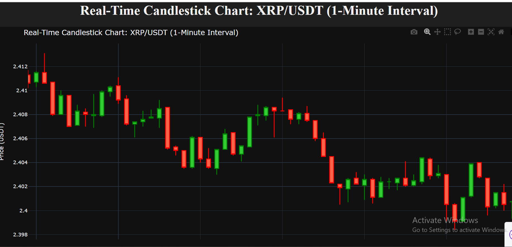

# ₿ Crypto Analysis: Real-Time Visualization and Exploratory Data Analysis

This repository contains a full project focused on cryptocurrency market analysis, combining historical data exploration using Jupyter Notebooks and a live, streaming data visualization dashboard built with Plotly Dash.

The project demonstrates proficiency in data acquisition (via `yfinance` and `ccxt`), technical analysis visualization (Candlestick, Bollinger Bands), and building interactive web applications for financial data.

##  Project Components

The project is divided into two main parts:

| File Name | Description | Key Focus |
| :--- | :--- | :--- |
| `Crypto_EDA.ipynb` | **Exploratory Data Analysis Notebook** | Deep dive into historical crypto data (e.g., BTC, BNB, XRP) including descriptive statistics, return analysis, and advanced charting (Bollinger Bands, Moving Averages). |
| `realtime_crypto.py` | **Live Dash Visualization App** | A Python script that runs a Dash web application to display a real-time (1-minute interval) updating Candlestick and Volume chart for a specified cryptocurrency (default: `XRP/USDT`) using the `ccxt` library. |

***

##  Real-Time Dashboard (`realtime_crypto.py`)

This application provides a dynamic, live-updating view of cryptocurrency trading data.

### Features
* **Real-Time Data:** Fetches live 1-minute OHLCV (Open, High, Low, Close, Volume) data from Binance using the `ccxt` library.
* **Candlestick Chart:** Displays interactive candlestick plot using Plotly for price action analysis.
* **Volume Subplot:** Includes a synchronized volume bar chart underneath the price action, colored by price direction (green for up, red for down).
* **Interval Control:** The chart updates every **5 seconds** to refresh the latest 1-minute candle.

### How to Run the Live App

1.  **Prerequisites:** Python 3.x.
2.  **Install Dependencies:**
    ```bash
    pip install dash pandas plotly ccxt
    ```
3.  **Run the script:**
    ```bash
    python realtime_crypto.py
    ```
4.  **Access the App:** Open your web browser and navigate to:
    ```
    [http://127.0.0.1:8050/](http://127.0.0.1:8050/)
    ```

***

##  Exploratory Data Analysis (`Crypto_EDA.ipynb`)

The Jupyter Notebook documents the process of acquiring and analyzing historical data for multiple crypto assets.

### Key Analysis & Visualizations
* **Return Analysis:** Calculates and identifies maximum return dates and values, and minimum return dates and values for selected tickers (BNB-USD, BTC-USD, ETH-USD, XRP-USD).
* **Advanced Charting:** Includes a Candlestick chart complete with **Bollinger Bands** (MA20, Upper Band, Lower Band) for technical insights.

### Tools and Libraries

| Category | Library | Purpose |
| :--- | :--- | :--- |
| **Data** | `pandas`, `numpy` | Data manipulation and numerical operations. |
| **Acquisition** | `ccxt` | Fetching real-time exchange data (Binance). |
| **Visualization** | `Plotly`, `Dash` | Creating interactive, professional charts and the web dashboard. |

***
## Limitations

1.  **Polling vs. True Real-Time Streaming (WebSocket):** The current `realtime_crypto.py` uses periodic API polling every 5 seconds. This is not genuinely "real-time" and introduces inherent latency. A true low-latency solution requires **WebSockets**.

2.  **Lack of Flexibility:** The dashboard is hardcoded to a single ticker (`XRP/USDT`).

3.  **Limited Time Series Modeling:** The EDA focuses primarily on descriptive statistics and simple moving averages. It lacks deeper time series analysis, such as testing for stationarity, **volatility clustering**, or utilizing models like **ARIMA** or **GARCH** to understand risk.

---

## Future Enhancements

The project can be expanded significantly by focusing on the following areas:

### Live Dashboard Enhancements

1.  **WebSocket Integration:** Refactor the data acquisition layer of `realtime_crypto.py` to use a dedicated WebSocket connection for true, low-latency data streaming.

2.  **Dynamic Ticker and Exchange Selection:** Introduce user controls in the Dash app to allow selection of any available crypto pair and exchange.

3.  **Expanded Technical Indicators:** Integrate a dedicated library (e.g., `TA-Lib`) to allow users to overlay multiple complex indicators (RSI, MACD, Ichimoku Cloud) on the live chart.

### EDA Notebook Enhancements

4.  **Advanced Time Series Analysis:** Implement and document statistical models (e.g., GARCH for conditional volatility) to provide a more rigorous understanding of the assets' risk profiles and future price distribution.

5.  **Feature Engineering and ML Readiness:** Implement feature engineering (e.g., lag features, advanced indicator calculation) within the notebook to prepare the dataset for future integration with machine learning models for prediction.

6.  **Comparative and Portfolio Analysis:** Add a dedicated section for calculating and visualizing the correlation matrix of returns across a basket of top crypto assets.

---

## Project Screenshots

| | | **Real-Time Dash Application**



 |  | |
| *Live chart view of XRP-USDT data* <!--|*Historical analysis showing Bollinger Bands on XRP/USD* | *Summary of Max/Min Returns for selected tickers* |-->

--- 

*This project was developed for demonstration and educational purposes only and is not financial advice.*
